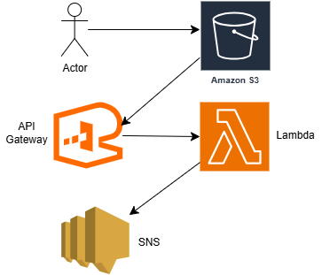
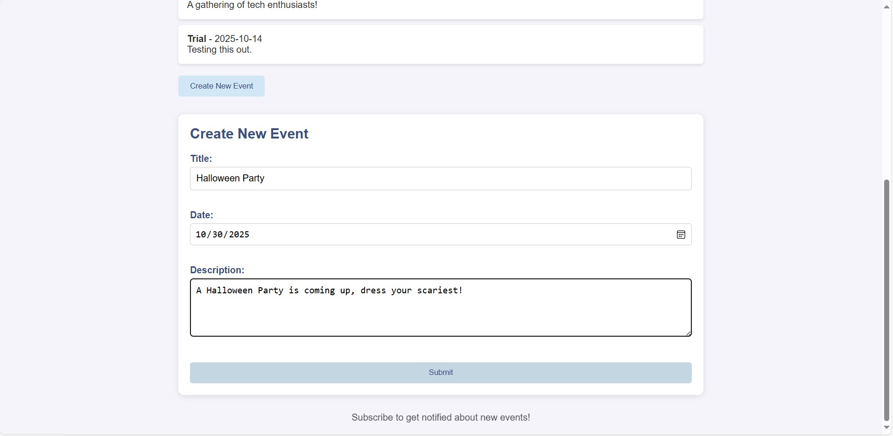
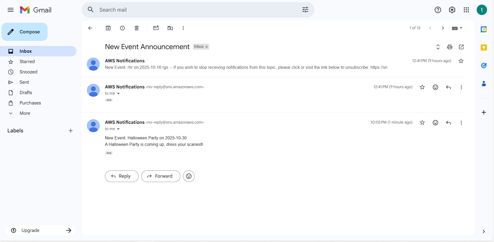

# 🚀 AWS Event Announcement System

A complete serverless event management system built on AWS cloud services. Users can create events, subscribe to notifications, and receive real-time email updates.

## ✨ Live Demo
[**View Live Application**](#) <!-- We'll add your link later -->

## 📋 Features
- ✅ **Event Creation** - Create new events with name and date/time
- ✅ **Email Subscriptions** - Users can subscribe/unsubscribe to notifications  
- ✅ **Real-time Notifications** - Instant email alerts for new events
- ✅ **Serverless Architecture** - Fully managed AWS services
- ✅ **Responsive Design** - Works on desktop and mobile devices

## 🏗️ System Architecture

### AWS Services Used:
- **Amazon S3** - Static website hosting for frontend
- **API Gateway** - REST API endpoints
- **AWS Lambda** - Serverless backend functions
- **Amazon SNS** - Email notification service

## 🎯 How It Works

1. **Frontend (S3 Hosted)**
   - Users interact with responsive web interface
   - HTML/CSS/JavaScript hosted on S3 bucket
   - LocalStorage for temporary event data

2. **Backend (API Gateway + Lambda)**
   - `createEvent` - Processes new events and triggers notifications
   - `subscribeUser` - Manages email subscriptions via SNS
   - Real-time email delivery to subscribers

## 📸 Screenshots

### Main Interface

### Events List & Subscription System

### Email Notification Proof

## 🛠️ Technical Implementation

### Frontend Technologies
- HTML, CSS, JavaScript
- Responsive design for mobile/desktop
- Browser LocalStorage for data persistence
- AWS SDK for JavaScript

### Backend Services
- **AWS Lambda** - Node.js runtime for serverless functions
- **API Gateway** - RESTful API endpoints
- **Amazon SNS** - Email notification service
- **S3** - Static web hosting with HTTPS

## 🔧 Project Setup

### Frontend Deployment
1. Upload HTML, CSS, JS files to S3 bucket
2. Enable static website hosting
3. Configure bucket policy for public read access

### Backend Configuration  
1. Create Lambda functions for event handling
2. Set up API Gateway endpoints
3. Configure SNS topics for email notifications
4. Set up IAM roles and permissions

## 🚀 Try It Out

1. Visit the application URL
2. Subscribe with your email address
3. Create a new event with name and date
4. Receive email notification instantly!

## 👨‍💻 Author

**Namandeep Singh** - Computer Science Graduate
- [Portfolio](#) <!-- Add your portfolio link later -->
- [LinkedIn](#) <!-- Add your LinkedIn link later -->

---

*Built with AWS Serverless Technologies - S3, Lambda, API Gateway, and SNS*
